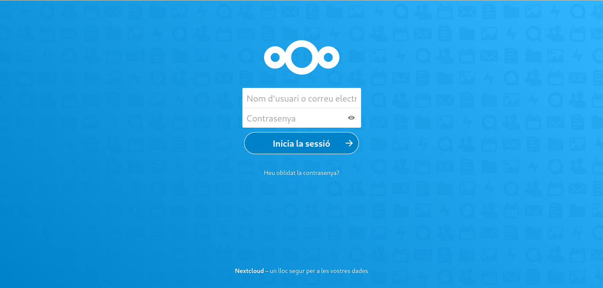

# Configuracion de nextcloud

  En este documento se explicara como hacer la configuracion del nexcloud, para ello previamente tenemos que instalar este mismo, en caso de no estar instalado consulte el manual de instalancion.

  Primero de todo tienes que iniciar sesion en nextcloud, para ello buscas en un navegador `localhost:8080` y aparecera la ventana de inicio de sesion, simplemente ponemos el usuario y contraseña que hemos puesto en los comandos de la instalacion y accederemos al Nextcloud.
  

### Creacion de usuarios y grupos
 
